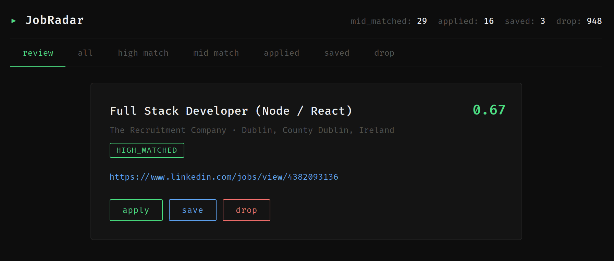
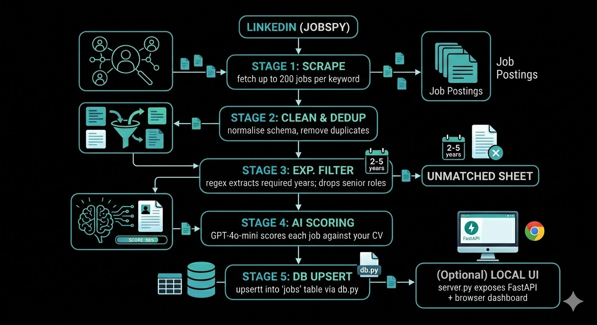

# 📡 JobRadar


> An end-to-end job search automation pipeline that scrapes LinkedIn daily, filters out roles you'll never get, and uses AI to score the ones worth applying to — all saved in a Supabase/Postgres database with an optional local FastAPI UI for instant review.



---

## How It Works



Each run is **incremental** — jobs already recorded in a previous run are skipped automatically.

---

## Quickstart

### 1. Clone & install

```bash
git clone https://github.com/runxii/job-radar.git
cd job-radar
pip install -r requirements.txt
```

### 2. Add your CV

Create a `cv.txt` in root, and paste your CV as plain text into `cv.txt`. The AI scorer reads this file to evaluate your fit against each job description.

```
cv.txt
──────
Name: Your Name
Education: BSc Computer Science, 2024
Skills: Python, React, Node.js, PostgreSQL, Docker ...
Experience: ...
```

### 3. Set your OpenAI API key

```bash
# Mac / Linux
export OPENAI_API_KEY=sk-...

# Permanent set in Linux
echo "export OPENAI_API_KEY=sk-..." >> ~/.bashrc

# Windows (PowerShell)
setx OPENAI_API_KEY sk-...
```

### 4. Run

```bash
python main.py
```

Output is saved to your Supabase/Postgres table `jobs`.

- `raw`: initial scraped records (upserted every run)
- `high_matched`, `mid_matched`, `Drop`, `Applied`, `Saved`: status-based buckets

### 5. Optional: Run local review server

```bash
# with uvicorn installed
uvicorn server:app --reload
```

Open `http://localhost:8000` to review job cards and update status interactively.

---

## Configuration

All tunable parameters live in `config.py`:

### Search

| Parameter | Default | Description |
|---|---|---|
| `SEARCH_QUERIES` | `["Software Engineer", "Graduate Engineer", ...]` | Keywords sent to LinkedIn. Add or remove as needed. |
| `SEARCH_LOCATION` | `"Ireland"` | Location string passed to JobSpy. |
| `RESULTS_WANTED` | `50` | Max results per keyword. Up to 200 supported. |
| `HOURS_OLD` | `24` | Only return jobs posted within this many hours. |

### Experience Filter

| Parameter | Default | Description |
|---|---|---|
| `MAX_YEARS_EXPERIENCE` | `3` | Jobs requiring more than this many years are sent to `unmatched`. |

### AI Scoring

| Parameter | Default | Description |
|---|---|---|
| `OPENAI_MODEL` | `"gpt-5-mini"` | Model used for scoring. Swap to `gpt-5` for higher accuracy. |
| `HIGH_MATCH_THRESHOLD` | `0.65` | Score at or above this → `high_matched` |
| `MID_MATCH_THRESHOLD` | `0.40` | Score at or above this → `mid_matched`. Below → `Drop` |

### Output

| Parameter | Default | Description |
|---|---|---|
| `CV_PATH` | `"cv.txt"` | Path to your CV text file. |
| `SUPABASE_URL` | `""` | Supabase project URL (set via env var). |
| `SUPABASE_KEY` | `""` | Supabase anon/service key (set via env var). |

---

## AI Scoring Logic

Each job is scored across three axes, then averaged into `overall_fit`:

| Axis | What it measures |
|---|---|
| `stack_match` | Overlap between JD's tech stack and your CV |
| `responsibility_match` | How closely the day-to-day work matches your experience |
| `engineering_signal_match` | Depth of engineering culture vs support/ops role |

### Score calibration

| Score | Label | Meaning |
|---|---|---|
| ≥ 0.70 | **high_matched** | Strong fit — meets most requirements |
| 0.40 – 0.64 | **mid_matched** | Partial fit — worth reviewing manually |
| < 0.40 | **Drop** | Poor fit — fundamental mismatch |
| 0.00 | **Hard disqualified** | Triggered a hard disqualifier (see below) |

### Hard disqualifiers

A job scores `0.00` immediately if any of the following are detected:

- Mandatory spoken/written language other than English or Chinese
- Mandatory degree requirement outside computer science
- Role is primarily non-technical (customer service, sales, HR, etc.)
- Explicitly requires Stamp 4 or EU/EEA citizenship as mandatory

---

## Project Structure

```
JobRadar/
├── main.py                  # Pipeline orchestrator
├── config.py                # All tunable settings
├── scraper.py               # Stage 1 — JobSpy LinkedIn scraper
├── cleaner.py               # Stage 2 — schema normalisation & dedup
├── experience_filter.py     # Stage 3 — regex year extraction & filtering
├── ai_scorer.py             # Stage 4 — OpenAI scoring
├── db.py                    # Stage 5 — Supabase/Postgres upsert writer
├── server.py                # FastAPI local review server
├── cv.txt                   # Your CV (plain text)
├── requirements.txt
├── output/                  # (optional local output folder; not required for DB flow)
└── tests/
    ├── test_scraper.py
    ├── test_cleaner.py
    ├── test_experience_filter.py
    ├── test_ai_scorer.py
    └── test_db.py
```

---

## Running Tests

```bash
pytest tests/ -v
```

94 unit tests across all 5 modules. External APIs (JobSpy, OpenAI) are fully mocked — no OPEN_AI_API key or internet connection required to run the test suite.

Unit test coverage report by `pytest-cov`:

``` bash
Name                              Stmts   Miss  Cover
-----------------------------------------------------
ai_scorer.py                         52      6    88%
cleaner.py                           23      0   100%
config.py                            13      0   100%
db.py                                83      4    95%
experience_filter.py                 47      2    96%
main.py                              42     42     0%
scraper.py                           22      2    91%
server.py                            38     38     0%
tests\test_ai_scorer.py              88      0   100%
tests\test_cleaner.py                53      0   100%
tests\test_db.py                    179      0   100%
tests\test_experience_filter.py      80      0   100%
tests\test_scraper.py                38      0   100%
-----------------------------------------------------
TOTAL                               758     94    88%
```

---

## Requirements

- Python 3.10+
- OpenAI API key
- No LinkedIn account required (JobSpy scrapes public listings)

```
python-jobspy
openai>=1.0.0
pandas>=2.0.0
pytest>=7.0.0
supabase>=1.0.0
fastapi>=0.110.0
uvicorn>=0.23.0
```

---

## License

MIT
